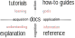

# ELECTRE Tri-B documentation

by Christian Ghiaus (Researcher ID: [ORCID](https://orcid.org/0000-0001-5561-1245), [SciProfiles](https://sciprofiles.com/profile/2970335), [Scopus](https://www.scopus.com/authid/detail.uri?authorId=6603390490), [Web of Science](https://www.webofscience.com/wos/author/record/1651371), [HAL](https://cv.hal.science/cghiaus))

> Figure 1. Forms of documentation (adapted after [Procida 2017](https://diataxis.fr)).

Documentation is organized according to Diátaxis framework ([Procida 2017](https://diataxis.fr)). The four types of documentation are positioned along two axes that represent different aspects of the user's needs and interaction with the content:
- cognition vs. action;
- acquisition vs. application.

These axes create four quadrants that define the characteristics of each documentation type (Figure 1):
- __Tutorials__ are structured learning experiences through a series of guided steps to solve a meaningful problem. Users actively engage with the material (_action_) aimed at helping them gain new knowledge and skills (_acquisition_).
- __How-to Guides__ provide directions for specific goals. Users follow steps to accomplish a task (_action_)
applying existing knowledge to solve particular problems (_application_).
- __Reference__ offers detailed technical information on Python modules in an orderly way. Users can look for information (_cognition_) in order to apply it to their existing projects (_application_).
- __Explanation__ provides context and deeper understanding. Users study explained concepts (_cognition_) helping them gain new insights and knowledge (_acquisition_)

# Bibliography
Procida, D. (2017). Diátaxis documentation framework. URL https://diataxis.fr.
